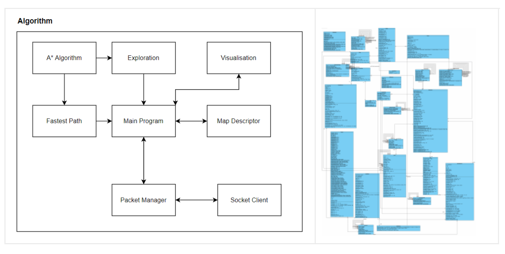
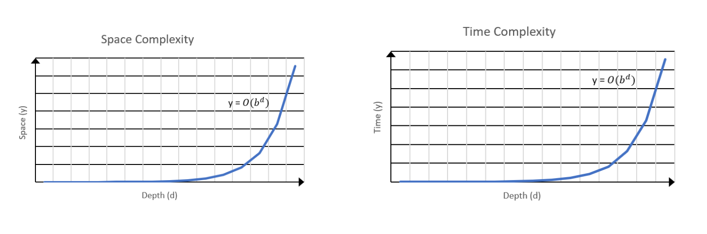
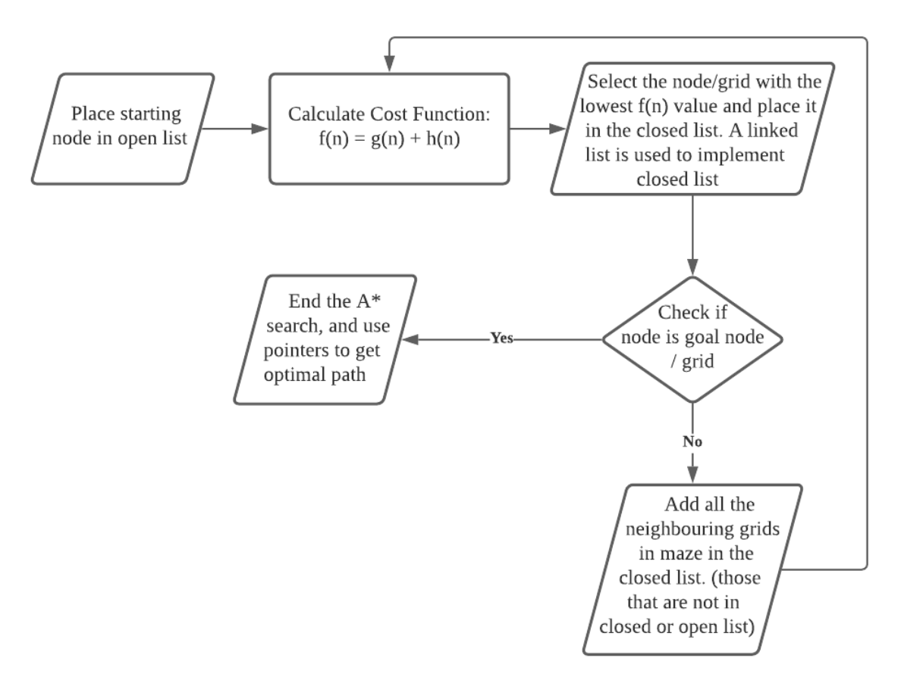

# MDP: Algorithms Subsystem

## Architecture 


<p align="center"> Fig. Architecture Overview (RIGHT), Class Diagram (LEFT) [refer to this <a href="https://github.com/anushadatta/MDP/blob/main/Algorithms/assets/class-diagram.png">link</a> for a clearer image] </center>

## Connection with Raspberry Pi
The algorithm uses sockets to establish a connection with the RPi, and then forwards data packets to it over Wi-Fi, which the RPi further processes and forwards to other sub-systems. The algorithm connects to the RPi with IP __192.168.9.9__ and port __8081__ by using the RPi’s dedicated Wi-Fi network, to prevent access from other PCs. The code snippet for establishing the connection is:

```
public boolean connectToDevice() {
    try { 
        InetSocketAddress ISA = new InetSocketAddress(IP_Addr, Port);
        socket = new Socket();
        socket.connect(ISA, timeout);
    } catch (UnknownHostException u) {
        System.out.println(u);   
    }
    return false;
}
```

## Exploration Algorithm
Our exploration uses the __right wall hugging__ algorithm, where every decision that the robot makes, navigates around obstacles and keeps it sticking to the right wall. The decision made by the robot, when it is facing right is as follows (similarly for other directions robot faces in):
* If can move downwards and previously facing right, then _Turn Left_
* If cannot move downwards and can move right, then _Move Forward_
* If cannot move downwards or right, then _Turn Left_
* Else if no wall beside robot, _Back track_

The algorithm uses an enum of 4 main values: EMTPY, OBSTACLE, UNEX- PLORED_EMPTY and UNEXPLORED_OBSTACLE. 
Initially, the entire map is set to unexplored. Once the robot completes hugging the right wall and returns to the start point, it computes the fastest path to the unexplored areas (using __A* search__), explores the type of the unexplored cells, and then makes its way back.

Our algorithm also solves the issue of __phantom blocks__ (blocks seen by the sensors but do not actually exist) by overwriting grids, and in the worst case,
__backtracking__ the robot to the last correct location and again performing the same steps.

## Fastest Path Algorithm
The fastest path algorithm uses the popular __A* search__, a _complete, optimal graph traversal algorithm_, given a start node and a goal node. The space com- plexity of the A* algorithm is __O(|V|) or O(bd)__, the number of cells in the arena. The time complexity of the A* search algorithm is __O(|E|) or O(bd)__, the total number of possible movements to the new cell.



### Formulation of Cost
Our A* search algorithm calculates the evaluation function _f(n) = g(n) + h(n)_ where _g(n)_ is the actual path cost to the node n and _h(n)_ is the heuristic cost from node n to the goal node. We have defined _h(n) = (end_x-x) + (end_y-y)_, that is, the sum of the differences in x and y coordinates from node n to the goal node. The A* search chooses the neighboring node with the lowest value evaluation function. Th detailed flowchart for our algorithm is as follows:

<p align="center"></p>

To ensure the robot passes through the waypoint, the algorithm first calculates the shortest path from start to the waypoint, and then from the waypoint to the goal node.
