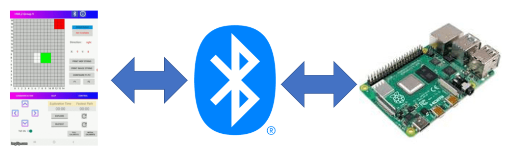
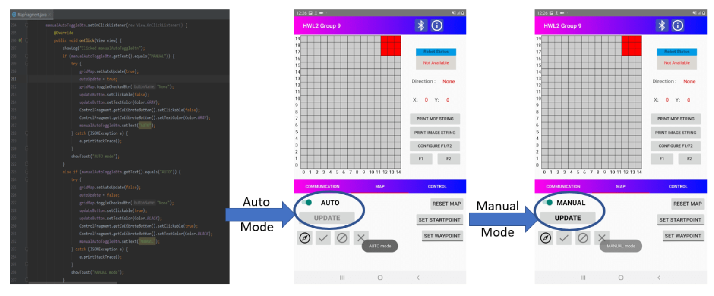
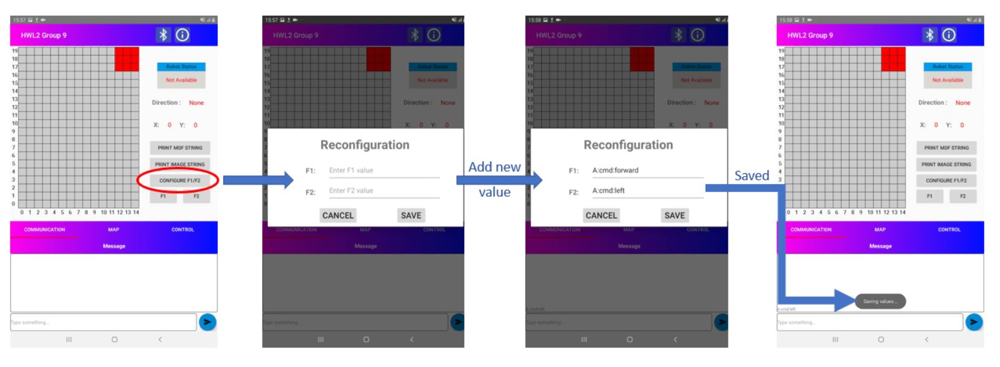
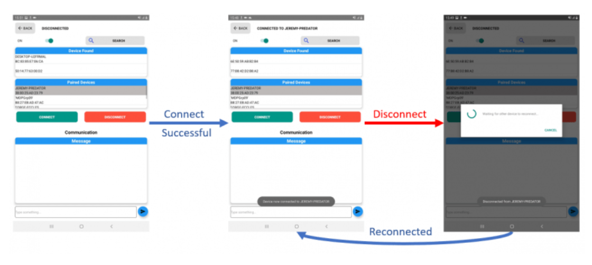
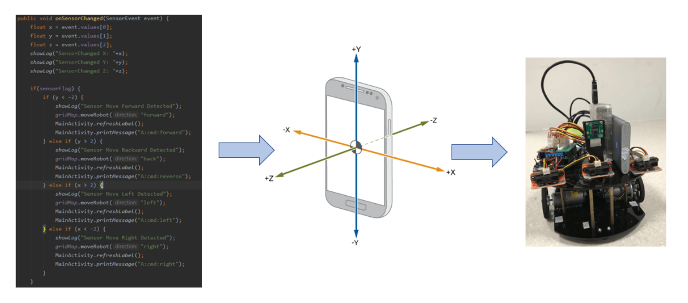

# MDP: Android Subsystem

## Architecture 

The RPi is connected to Nexus 7 tablet via Bluetooth with the use of _rfcomm protocol_. The robot service will be the main program where the simulated robot is designed on Android. The grids represent the cells in the arena (unexplored/ explored/ obstacles / free space). The robot and grids would make up the Android program components, making the Android application functional.

## Functionalities

### 1) The Android application (AA) can transmit and receive text strings over the Bluetooth serial communication link
If the _BluetoothConnectionService == true_, then the message can be transmitted using the __MainActivity.printMessage(String Message)__ function. This function will convert the message into bytes and call Bluetooth service class to write over to RPi; BluetoothServices.write(bytes).

### 2) Functional graphical user interface (GUI) that can initiate the scanning, selec- tion and connection with a Bluetooth device
A _Listview_ is a setup for paired devices and newly discovered devices, respectively. The scanning / device discovery is made by calling the __startDiscovery__ function (requesting for discovery through the _BluetoothAdapter_). When a device is chosen by the user, the __MAC address__ of the device is sent back to the parent Activity in the result Intent. A new _ConnectThread_ is created to initiate a connection with the chosen device. The thread is started by calling __mConnect- Thread.start()__ in order for the thread to manage the connection and perform transmissions.

### 3) Functional GUI that provides interactive control of the robot movement via the Bluetooth link (e.g. move forward, left and right)
To control the robot movement, four control buttons, namely, U (Up), R (Right), L (Left) and D (Down), are provided on the main screen of the application. When the user clicks any one of these buttons, a corresponding message is sent to the RPi.

* U : MainActivity.printMessage(“A:cmd:forward”); 
* R : MainActivity.printMessage(“A:cmd:right”);
* D : MainActivity.printMessage(“A:cmd:reverse”); 
* L : MainActivity.printMessage(“A:cmd:left”);

### 4) Functional GUI that indicates the current status of the robot (e.g. stop, moving, etc.).
When the movement control buttons are pressed, the _printMessage_ method will be invoked. The message is saved in _sharedPreferences_. The _Communication-Fragment_ class retrieve the string from the _sharedPreferences_ and display all the command received and commands to send on the text box at the bottom of the screen.

### 5) Functional GUI that provides the selection of Manual or Auto-updating of the graphical display of the maze environment

The Android GUI allows the selection of Manual or Auto state, through which the grid gets updated. On selecting the auto-update selection the grid automatically gets updated. In the case that the auto-update state is toggled to a manual update, the robot’s position on the grid gets updated only when the user manually clicks the movement button. This feature is implemented by calling the method _manualAutoToggleBtn.setOnClickListener()_, which checks for _manual-AutoToggleBtn_ text value (manual or auto) and calls _setMap()_ method to update the display on the map.

### 6) Functional GUI that provides two buttons that supports persistent user re-configurable string commands to the robot

The GUI has two buttons F1 and F2 which contain a string value and are reconfigurable. For implementing the reconfigurable buttons _shared preferences_ is used that enables to store the value of the strings and retrieve the values upon restarting the system. On click of either of these buttons the _f1.onClickListener()_ or the _f2.onClickListener()_ method is called respectively. When the respective method is called the String value that is stored in association with the button is extracted and transmitted to the PC or the robot.

### 7) Robust connectivity with Bluetooth devices

The app allows for scanning for devices and connecting to devices found. Once two devices are connected the connection between them is robust. The Bluetooth connection ensures that even if the connection is lost or gets hung during transmission, the connection can re-establish itself without any extra step from our end.

### 8) Using tablet IMU to move robot on tilt

In the application, an addition tilt sensing feature has been implemented using the method _phoneTiltSwitch.setOnCheckedChangeListener()_. Through this feature, the position of the robot can be changed on the grid by tilting the device.
