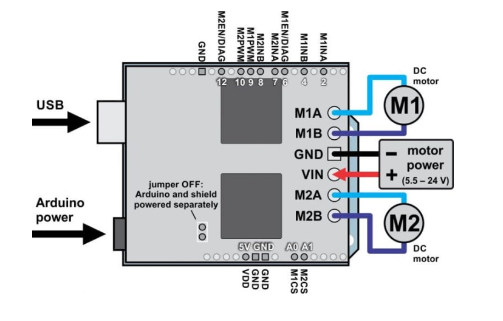
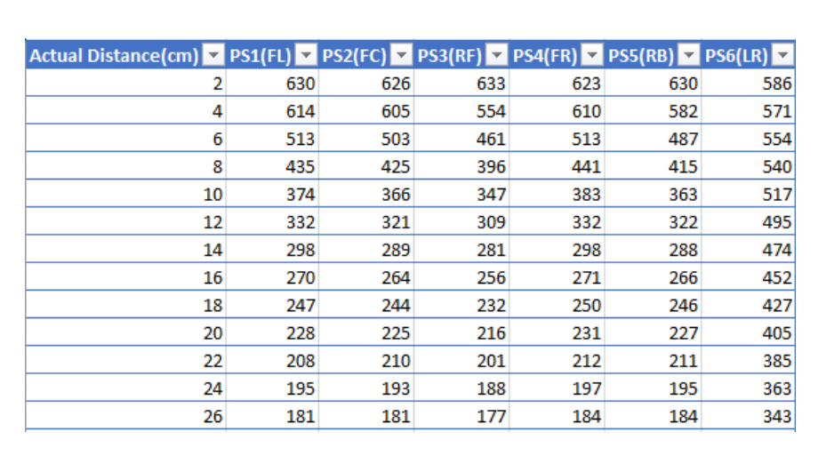
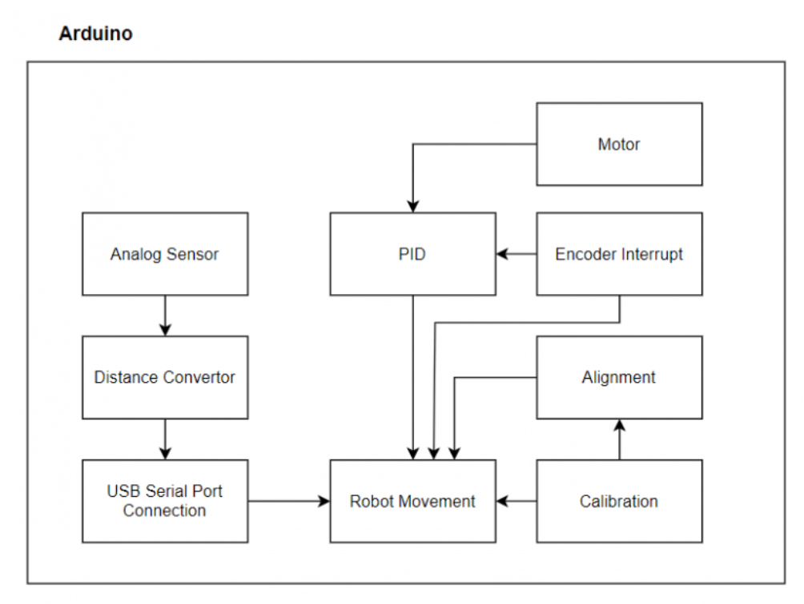
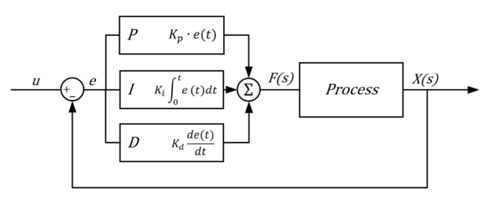
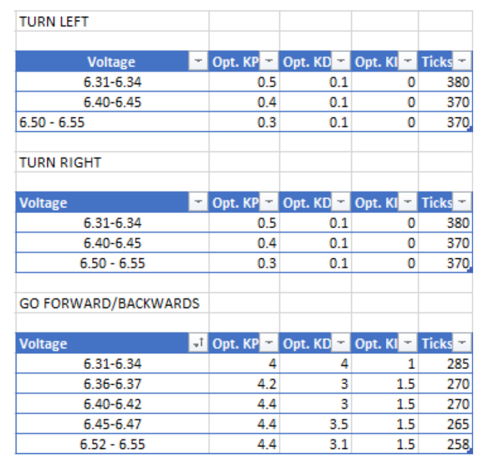
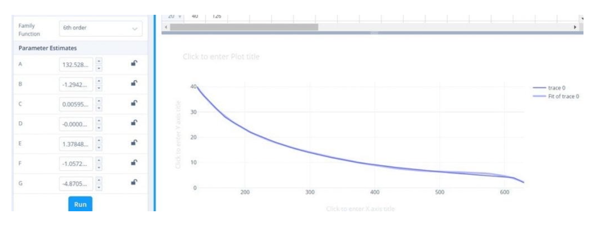

# MDP: Arduino Subsystem

## Architecture
__Motor – Pololu dual VNH5019 motor driver shield__
<p align="center"></p>

VNH5019 motor driver shied is connected to Arduino Uno to control the two bi-directional, high power DC motors. Based on the schematics, driver pins M1A, M1B, M2A and M2B are used to enable the DC motors. For this case, M1 is the Left DC Motor whereas M2 is the Right DC Motor.

__Sensor – SharpIR GP2Y0A21YK0F (short range) and GP2Y0A02YK0F (long range)__

To obtain optimal sensor data readings, we collected <u>30 samples</u> and plotted graphs to generate best-fit curve and retrieve the average calculation of one measurement. Below shows readings for every 2cm (smaller is higher accuracy):
<p align="center"></p>

An overview of the architecture of the Arduino System may be observed below:
<p align="center"></p>

## Calibrations
__Motor Calibration__
<p align="center"></p>

By nature, M1 and M2 wheels are intrinsically different in speed due to hardware. During our runs, we discovered that M1(left wheel) produces a higher number of encoder ticks than M2(right speed). In order to get a stable motion control, a timer-based PID control interrupt system is used to synchronized the wheels. We implemented a timer that interrupts every __80ms__ to calculate the error accumulated over time, and perform calculations to match the slower wheel with the speed of faster wheel, by using _kp, ki, kd and grad_ values. Since timer-based PID is voltage sensitive, we created a table with PID values for different voltage levels:

<p align="center"></p>

__Sensor Calibration__
Placement: 3 short-range (front), 2 short-range (right), 1 long-range (left).

Steps:

1. Use a program to generate a 6th order equation (for maximum accuracy) that best fits the plotted graph from the sensor readings data.
2. Each equation generated is unique to a sensor. This process of generating equations are repeated for all other 5 sensors.

<p align="center"></p>

## Implementation

As mentioned above, the Arduino uses the timer-based PID control system, for accurate rotation of wheels, in terms of direction and movement ticks, based on the command received. For example, for forward movement, we would use the following function signature, where the parameters M1 and M2 guide how both wheels rotate forward, and the other 3 arguments are specific to the command:

```
 PID_control(1, 1, 1.5, 0.1, 0.3); // M1, M2, kp, kd, ki
```

For exploration task, we had implemented several types of calibrations, to ensure that the robot is always positioned at the center of the grid and that its center is always at a distance of 15 cm from the walls and obstacles. The main calibration functions were _caliRightAngle()_ to stay at a right angle with the wall, and _caliFrontDistance()_ to stay at a distance of 15 cm from the wall. 
