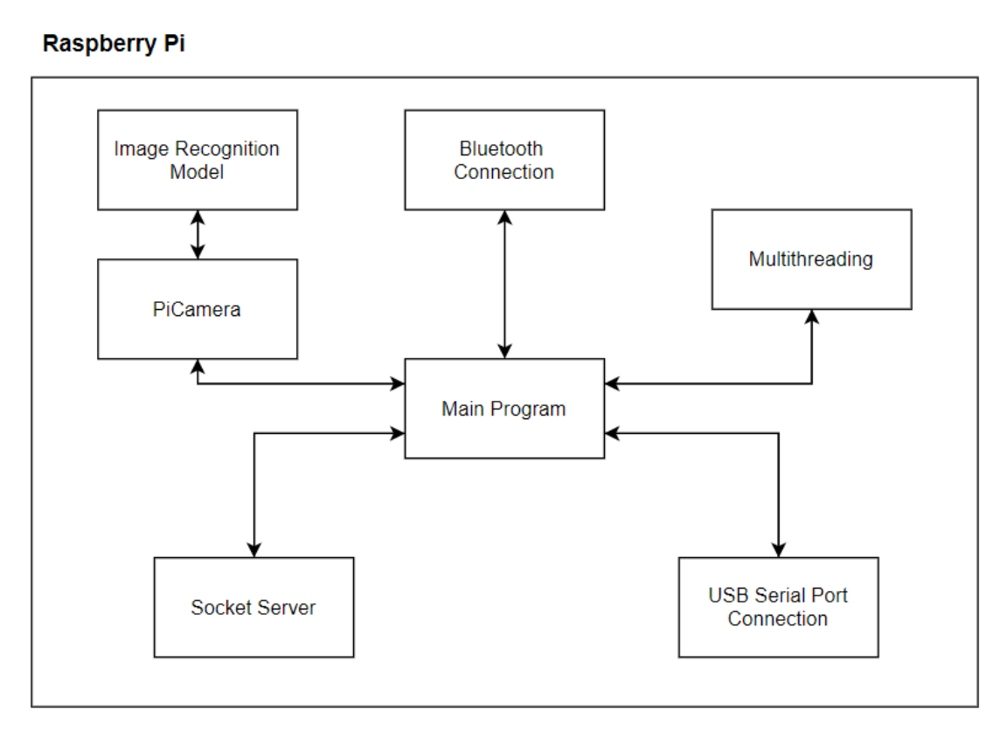
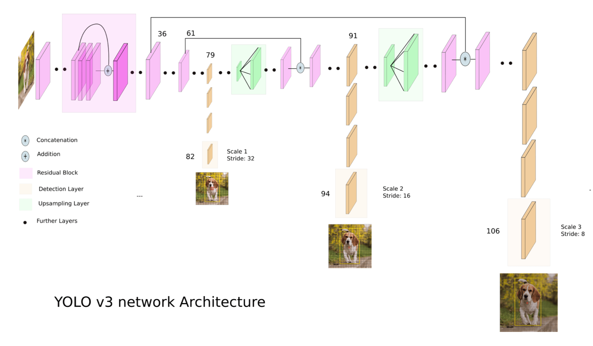

# MDP: RaspberryPi Subsystem

## Architecture 

<p align="center"></p>

To coordinate tasks of receiving, handling & processing different messages from all components concurrently, RPi code is multithreaded, with a thread dedicated for each component. This is in line with proper software design principles of __encapsulation__ & __abstraction__, as each thread provides logic to handling different packets but keeps implementation hidden from the main program, much like a black box.

Multithreading is handled in the Main program, which invokes the appropriate thread when a packet arrives. There are 4 subprograms – _PCManager, BluetoothManager, CameraManager, and ArduinoManager_ – for which 4 threads will run concurrently, with each program being executed as a separate thread. All instructions are put in a __queue__ and executed sequentially, using the __First-In-First-Out (FIFO)__ principle.

* The _PCManager_ establishes socket connection over WiFi, with the PC 
* The _CameraManager_ directs the PiCamera to click images and save the jpg
* The _BluetoothManager_ establishes Bluetooth connection with Android via rfcomm at port number 9
* The _ArduinoManager_ sets up USB serial port connection (using ACM – Abstract Control Model) with Arduino

### Communication and Processing of Messages
For the purpose of concurrent communication of messages, the Main program instantiates instances of different component managers (PCManager, ArduinoManager, BluetoothManager, CameraManager) and this starts a thread of each. Hence, during normal execution of the program, we have __1 main thread__ and __4 separate threads.__

The general format of a message is as follows:
```
sender : receiver : type : command

(Example – B:P:cmd:start_explore)
```

In the above example, B means that the command was sent by Android, while P means that it is indicating the PC to begin exploration algorithm. For processing the above message, the RPi will first split on the delimiter “:“, determine the sender, receiver, type and command and then call the receiver sub-routine to send the command to the sub-system for further handling. The RPi repeats the above process until the queue is empty or the program is stopped explicitly.

## Image Recognition 
To train the model, the 15 images are taken multiple times under different conditions such as lighting, angles, elevation etc. to ensure a more reliable and accurate model. Almost all of the images have the maze as the background to better simulate the actual environment where the image will be taken to ensure better accuracy during the image recognition task. A total of around __2000__ images are utilized in the __training set__ and an additional __300__ images are used in the __validation set.__

### Model Training


__YOLOv3__ is utilized for object detection. YOLOv3 uses a single neural network and applies it to the image. It divides the image into regions and predicts bounding boxes and probabilities for each region. The bounding boxes are weighted by probabilities and their predictions. It is an adaptation from the Darknet. It has a framework to train neural networks, and the detection has __106 layers__ of fully convoluted architecture. It contains features like skip connections and 3 prediction heads in their feature extraction. It applies a __1×1 kernel__ at feature maps of 3 different sizes at 3 different places in the network. YOLOv3 makes a prediction at 3 scales, by exactly down sampling the input images by 32, 16, and 8.

__FINAL MODEL__ Loss: 6.7%, Number of Epochs: 100

For the training of the model, at the first epoch, an _h5 model file_ is generated with its corresponding _detection config JSON file_, having the anchor weights. In the subsequent epochs, only models with lower loss would be generated and saved into the folder directory. The model with the lowest loss is finally used as the model.

### Model Prediction 
For the purpose of the image recognition task, we had 2 parallel scripts running, to offload the image processing work from the RPi, onto a PC with a better CPU. This second PC would be connected to RPi over __SSH__. Our program runs the image recognition over each image, that shows the chosen model detecting the images, deciding coordinates and finding bounding boxes. The main flow for each image recognition is as follows:

1. PiCamera takes 1 photo at every step (movements and calibrations).
2. A script running on the PC would detect the image saved in RPi and copy it locally using __Paramiko SSH client__.
3. The PC identifies image, draws bounding box and saves the result locally.

For each image, the PC saves a file on RPi over SSH, with the following format: ```x–y–id``` where x and y are the coordinates and id is the image ID. The RPi then sends this information over to the Android for display on the Virtual Map.


